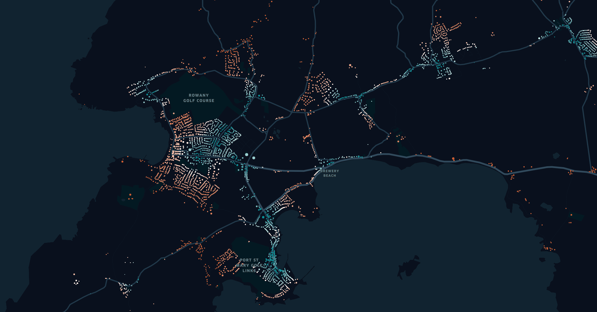
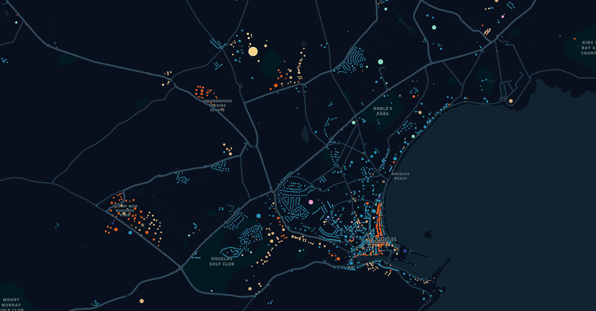

# OSMOX

A tool for extracting locations and features from OpenStreetMap (OSM) data.

## Why?

We use OSMOX to extract locations from OSM for city or national scale agent-based models. In particular, the focus tends to be on extracting buildings and their designated usages, for example `homes`, `schools`, `medical facilities` and `places of work`. However, this can also be abstracted to other objects such as transit, parks or land use.

Under the hood, OSMOX is a collection of labelling and GIS-type operations:

- filtering
- activity labelling
- simple spatial activity inference
- feature extraction (such as floor areas)
- filling missing data

Once assembled, these form part of our wider pipeline. But as a standalone tool, OSMOX is useful for extracting insights from OSM in a reproducible manner.

 
*^ Isle of Man `distance_to_nearest_transit`.*

## Install

I. Installation for Mac
```{sh}
git clone git@github.com:arup-group/osmox.git
pip install osmox
# or pip -e install osmox
cd osmox
pytest
osmox --help
```

II. Installation for Windows

It is recommended to use an Anaconda environment for installation on Windows:

```{sh}
# Create a new environment in Anaconda
conda create -n osmox python=3.7
conda activate osmox
conda install geopandas

# Clone this repository locally
git clone git@github.com:arup-group/osmox.git

# Change directory
cd osmox

# Install the current directory in editable mode and test
pip install -e .
pytest
```


## Quick Start

Extract `home`, `work`, `education`, `shop` and various other activity locations ("facilities") for the Isle of Man:

`osmox run configs/example.json example_data/isle-of-man.osm example -crs "epsg:27700"` (paths given from OSMOX project root)

After about 30 seconds, you should find locations for the extracted facilities in the specified `example` directory. Each facility includes a number of features:

```{geojson}
{
    "type": "FeatureCollection",
    "features": [
        ...
        {
        "id": "13589",
        "type": "Feature",
        "properties": {
            "activities": "home",
            "area": 196,
            "distance_to_nearest_education": 816.4434678355371,
            "distance_to_nearest_medical": 366.81198701080626,
            "distance_to_nearest_shop": 133.12877450643526,
            "distance_to_nearest_transit": 122.33125535187033,
            "floor_area": 392.0,
            "id": 1869954720,
            "levels": 2.0,
            "units": 1
            },
        "geometry": {
            "type": "Point",
            "coordinates": [220894.60596542264, 467332.85704661923]
            }
        },
        ...
```

Outputs are written in geojson format as features with WGS-84 (EPSG:4326) CRS, so that they can be quickly inspected via [kepler](https://kepler.gl) or equivalent:


*^ Isle of Man facility `floor_area` feature. Approximated based on polygon areas and floor labels or sensible defaults.*


*^ Isle of Man `activities` feature. For simulations we use this information to control what agents can do where, but this is also a good disagregate proxy for land-use. In this example, blue areas are residential, orange commercial and brown is other work places.*

## OSMOX Run

`osmox run <CONFIG_PATH> <INPUT_PATH> <OUTPUT_PATH>` is the main entry point for OSMOX:

```{sh}
osmox run --help

Options:
  -crs, --crs TEXT  crs string eg (default): 'epsg:27700' (UK grid)
  -s, --single_use  split multi-activity facilities into multiple single-activity facilities
  --help            Show this message and exit.
```

Configs are described below. The `<INPUT_PATH>` should point to an OSM map dataset (`osm`(xml) and `osm.pbf` are supported). The `<OUTPUT_PATH>` should point to an exiting or new output directory.

## Options

The most common option you will need to use is `crs`. The default CRS is British National Grid (BNG, or EPSG:27700), so if you are working outside the UK, you should adjust this accordingly. Specifying a relevant CRS for your data is important if you would like to extract sensible units of measurement for distances and areas. If this isn't a concern, you can specify CRS as WGS-84 (`-crs epsg:4326`).

OSMOX will return multi-use objects where applicable. For example, a building that contains both a restaurant and a shop can be labelled with `activities: "eating,shopping"`. This can make simple mapping of outputs quite complex, as there are many possible versions of combined use. To work around this problem, the optionional flag `-s` or `--single_use` may be set to instead output unique objects for each activity. For example, for the above case, extracting two identical buildings, one with `activity: "eating"` and the other with `activity: "shopping"`.

## Configs

Configs are important, so we provide some examples in `mc/configs` and a validation method for when you start editing or building your own configs:

```{sh}
osmox validate <CONFIG PATH>
```

OSMOX features and associated configurations are described in the sections below.

## Output

After running `osmox run <CONFIG_PATH> <INPUT_PATH> <OUTPUT_PATH>` you should see something like the following (slowly if you are processing a large map) appear in your terminal:

```{sh}
Loading config from 'configs/config_NTS_UK.json'.
Configured activities: ['education', 'home', 'medical', 'other', 'shop', 'transit', 'visit', 'work']
INFO:osmox.main: Filtering all objects found in data/suffolk-latest.osm.pbf.
INFO:osmox.main: Found 118544 buildings.
INFO:osmox.main: Found 2661 nodes with valid tags.
INFO:osmox.main: Found 5647 areas with valid tags.
INFO:osmox.main: Assigning object tags.
Progress: |██████████████████████████████████████████████████| 100.0% Complete
INFO:osmox.main: Finished assigning tags: f{'existing': 49457, 'points': 711, 'areas': 54422, 'defaults': 13954}.
INFO:osmox.main: Assigning object activities.
Progress: |██████████████████████████████████████████████████| 100.0% Complete
INFO:osmox.main: Assigning object features: ['units', 'levels', 'area', 'floor_area'].
Progress: |██████████████████████████████████████████████████| 100.0% Complete
INFO:osmox.main: Assigning distances to nearest transit.
Progress: |██████████████████████████████████████████████████| 100.0% Complete
INFO:osmox.main: Assigning distances to nearest education.
Progress: |██████████████████████████████████████████████████| 100.0% Complete
INFO:osmox.main: Assigning distances to nearest shop.
Progress: |██████████████████████████████████████████████████| 100.0% Complete
INFO:osmox.main: Assigning distances to nearest medical.
Progress: |██████████████████████████████████████████████████| 100.0% Complete
INFO:osmox.main: Writting objects to: suffolk2/epsg_27700.geojson
INFO:osmox.main: Reprojecting output to epsg:4326 (lat lon)
INFO:osmox.main: Writting objects to: suffolk2/epsg_4326.geojson
INFO:osmox.main:Done.
```

Once completed, you will find OSMOX has outputted file(s) in `.geojson` format in the specified `<OUTPUT_PATH>`. If you have specified a CRS, you will find two output files, named as follows:
1) `<specified CRS code>.geojson`
2) `epsg_4326.geojson`

We generally refer to the outputs collectively as `facilities` and the properties as `features`. Note that each facility has a unique id, a number of features (depending on the configuration) and a point geometry. In the case of areas or polygons, such as buildings, the point represents the centroid.

```{geojson}
{
    "id": "32653",
    "type": "Feature",
    "properties": {
        "activities": "home",
        "area": 72,
        "distance_to_nearest_education": 298.3127023231315,
        "floor_area": 144.0,
        "id": 717793726,
        "levels": 2.0,
        "distance_to_nearest_medical": 614.1725582520537,
        "distance_to_nearest_shop": 170.41317833861532,
        "distance_to_nearest_transit": 157.88388248911602,
        "units": 1
        }, 
    "geometry": {
        "type": "Point",
        "coordinates": [613632.5100411727, 242323.73560476975]
    }
}
```

In the quick start demo, we specified the coordinate reference system as `epsg:27700` (this is the default, but we specified it for visibility) so that distance- and area-based features would have sensible units (metres in this case). If extracting data from other regions, we would encourage using the local CRS.

## Configuration

### Definitions

**OSMObjects** - objects extracted from OSM. These can be points, lines or polygons. Objects have features.
**OSMFeatures** - OSMObjects have features. Features typically include a key and value based on the [OSM wiki](https://wiki.openstreetmap.org/wiki/Map_features).

### Primary Functionality

The primary use case for OSMOX is for extracting a representation of places where people can do various activities ('education' or 'work' or 'shop' for example). This is done by applying a configured mapping to OSM tags:

- **Filter** OSMObjects based on OSM tags (eg: select 'building:yes' objects). Filtered objects are defined in a `config.json`. For example, if we were interested in extracting education type `buildings`:

```{json}
{
    "filter": {
        "building": [
            "kindergarden",
            "school",
            "university",
            "college",
            "yes"
        ]
    }, ...
}
```

- **Activity Map** object activities based on OSM tags (eg: this building type 'university' is an education facility). Activity mapping is based on the same `config.json`, but we add a new section `activity_mapping`. For each OSM tag (a key such as `building` and a value such as `hotel`,) we map a list of activities:

```{json}
{
    ...
    "activity_mapping": {
        "building": {
            "hotel": ["work", "visit"],
            "residential": ["home"]
        }
    }
}
```

Because an OSM tag key is often sufficient to make an activity mapping, we allow use of `*` as "all":

```{json}
{
    ...
    "activity_mapping": {
      ...
        "office": {
            "*": ["work"]
        }
    }
}
```

Note that the filter controls the final objects that get extracted but that the activity mapping is more general. It is typical to map tags that are not included in the filter because these can be used by subsequent steps (such as inference) to assign activities where otherwise useful tags aren't included. There is no harm in over-specifying the mapping.

These configs get very long - but we've supplied some full examples in the project.

### Spatial Inference

Because OSMObjects do not always contain useful tags, we also infer object tags based on spatial operations with surrounding tags.

The most common use case for this is building objects that are simply tagged as `building:yes`. We use the below logic to infer useful tags, such as 'building:shop' or 'building:residential'.

- **Contains** - If an OSMObject has no mappable tags (eg `building:yes`), tags are assigned based on the tags of objects that are contained within. For example, a building that contains an `amenity:shop` point is then tagged as `amenity:shop`.
- **Within** - Where an OSMObject *still* does not have a useful OSM tag, the object tag will br assigned based on the tag of the object that it is contained within. The most common case is for untagged buildings to be assigned based on landuse objects. For example, a building within a `landuse:residential` area will be assigned with `building:residential`.

In both cases we need to add the OSM tags we plan to use to the `activity_mapping` config, for example:

```{json}
{
    ....
    "activity_mapping": {
        "building": {
            "hotel": ["work", "visit"],
            "residential": ["home"]
        },
        "amenity": {
          "cafe": ["work", "eat"]
        },
        "landuse": {
          "residential": ["home"]
        }
    }
}
```

- **Default.** - Where an OSM object *still* does not have a useful OSM tag, we can optionally apply defaults. Again, these are set in the config:

```{json}
{
    ...
    "default_tags": [["building", "residential"]],
    ...
}
```

### Feature Extraction

Beyond simple assignment of human activities based on OSM tags, we also support the extraction of other features:

- areas
- floors
- floor areas
- units (eg residential units in a building)

These can be configured as follows:

```{json}
{
    ...
    "features_config": ["units", "floors", "area", "floor_area"]
    ...
}
```

### Distance to Nearest Extraction

OSMOX also supports calculating distance to nearest features based on object activities. For example, we can extract nearest distance to `transit`, `education`, `shop` and `medical` by adding the following to the config:

```{json}
{
    ...
    "distance_to_nearest": ["transit", "education", "shop", "medical"],
    ...
}
```

Note that the selected activities are based on the activity mapping config. Any activities should therefore be included in the activity mapping part of the config. You can use `osmox validate <CONFIG PATH>` to check if a config is correctly specified.

### Fill Missing Activities

We have noted that it is not uncommon for some small areas to not have building objects, but to have an appropriate landuse area tagged as 'residential'.

We therefore provide a very ad-hoc solution for filling in such areas with a grid of objects. This fill-in method only fills in areas that do not have the required activities already within them.

For example, given an area tagged as `landuse:residential` by OSM that does not contain any object of activity type `home`, the fill in method will add a grid of new objects tagged `building:house`. The new objects will also have activity type `home`, size `10 by 10` and be spaced at `25 by 25`:

```{json}
{
    ...
    "fill_missing_activities":
        [
            {
                "area_tags": [["landuse", "residential"]],
                "required_acts": ["home"],
                "new_tags": [["building", "house"]],
                "size": [10, 10],
                "spacing": [25, 25]
            }
        ]
}
```


*^ Example Isle of Man activity filling in action for a residential area without building locations.*

Note that the selected activities are based on the activity mapping config. Any activities should therefore be included in the activity mapping part of the config. You can use `osmox validate <CONFIG PATH>` to check if a config is correctly specified.

Multiple groups can also be defined, for example:

```{json}
{
    ...
    "fill_missing_activities":
        [
            {
                "area_tags": [["landuse", "residential"]],
                "required_acts": ["home"],
                "new_tags": [["building", "house"]],
                "size": [10, 10],
                "spacing": [25, 25]
            },
            {
                "area_tags": [["landuse", "forest"], ["landuse", "orchard"]],
                "required_acts": ["tree_climbing", "glamping"],
                "new_tags": [["amenity", "tree"], ["building", "tree house"]],
                "size": [3, 3],
                "spacing": [8, 8]
            }
        ]
    ....
}
```

## TODO

- this is slow for sure - for national scale extractions we're talking many hours. There are some areas that can be sped up, some that will paralellize ok. But treating all this as premature until an output format is nailed down and there are a few more users
- need tests for the use of all `*` in the config filter and mappings
- move to toml/yaml configs (but maybe not the json is ok)
- add zonal labelling (eg lsoa assignment)
- perhaps add a sampling format (zone:act:{viables})
- todo add support to keep original geometries
- add .shp option
- add other distance or similar type features, eg count of nearest neighbours
- warning or feedback when trying to process really large datasets

