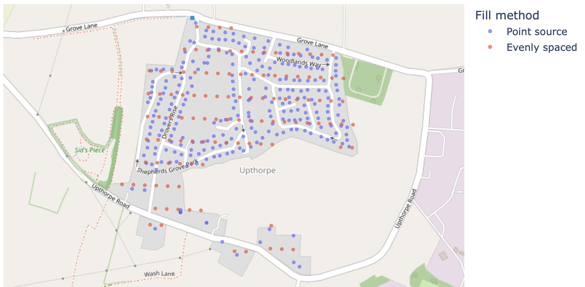
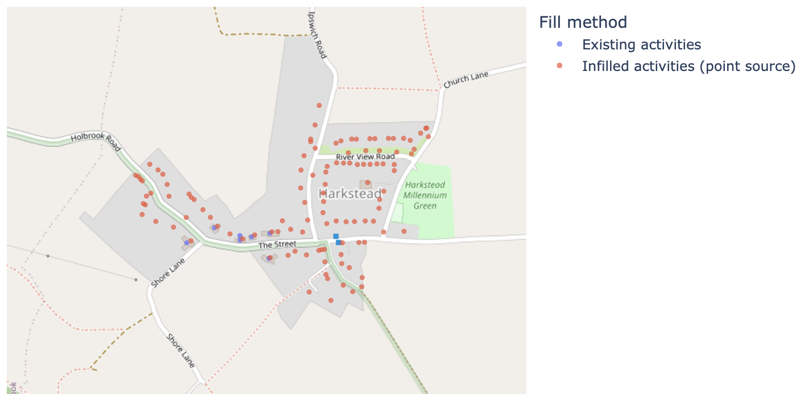
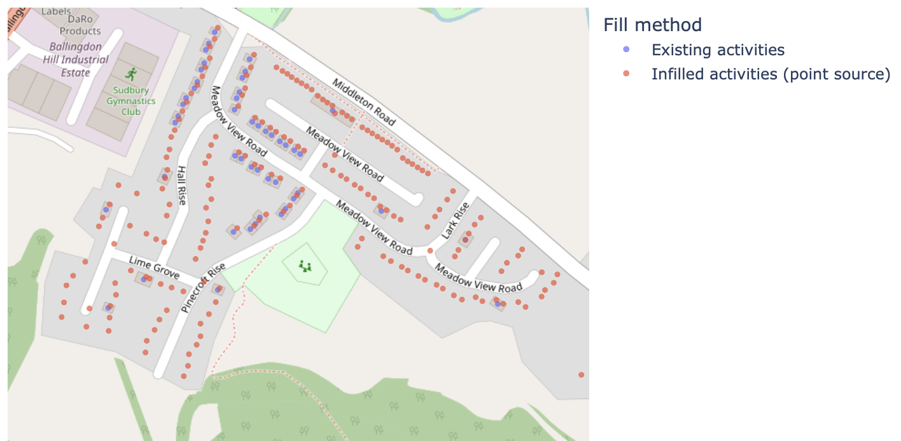

# Configuration

Configs are important, so we provide some examples in `configs` and a validation method for when you start editing or building your own configs:

```shell
osmox validate <CONFIG PATH>
```

OSMOX features and associated configurations are described in the sections below.

!!! warning
    These configs get very long - see the full examples in the `configs` to get an idea.

## Definitions

**OSMObjects** - objects extracted from OSM; can be points, lines or polygons; OSMObjects have features.

**OSMFeatures** - OSMObjects have features, which typically include a key and value based on the [OSM wiki](https://wiki.openstreetmap.org/wiki/Map_features).

## Primary Functionality

The primary use case for OSMOX is for extracting a representation of places where people can do various activities ('education' or 'work' or 'shop' for example).
This is done by applying a configured mapping to OSM tags:

### Filter

Filter OSMObjects based on OSM tags (eg: select 'building:yes' objects). Filtered objects are defined in a `config.json`.
For example, if we were interested in extracting education type `buildings`:

```json
{
    "filter": {
        "building": [
            "kindergarden",
            "school",
            "university",
            "college",
            "yes"
        ]
    }, ...
}
```

### Activity Mapping

Map object activities based on OSM tags (eg: this building type 'university' is an education facility).
Activity mapping is based on the same `config.json`, but we add a new section `activity_mapping`. For each OSM tag (a key such as `building` and a value such as `hotel`,) we map a list of activities:

```json
{
    ...
    "activity_mapping": {
        "building": {
            "hotel": ["work", "visit"],
            "residential": ["home"]
        }
    }
}
```

Because an OSM tag key is often sufficient to make an activity mapping, we allow use of `*` as "all":

```json
{
    ...
    "activity_mapping": {
    ...
        "office": {
            "*": ["work"]
        }
    }
}
```

!!! note
    The filter controls the final objects that get extracted, but the activity mapping is more general.
    It is typical to map tags that are not included in the filter because these can be used by subsequent steps (such as inference) to assign activities where otherwise useful tags aren't included.
    There is no harm in over-specifying the mapping.

## Spatial Inference

Because OSMObjects do not always contain useful tags, we also infer object tags based on spatial operations with surrounding tags.

The most common use case for this is building objects that are simply tagged as `building:yes`.
We use the below logic to infer useful tags, such as 'building:shop' or 'building:residential'.

### Contains

If an OSMObject has no mappable tags (eg `building:yes`), tags are assigned based on the tags of objects that are contained within.
For example, a building that contains an `amenity:shop` point, it is then tagged as `amenity:shop`.

### Within

Where an OSMObject *still* does not have a useful OSM tag, the object tag will be assigned based on the tag of the object that it is contained within.
The most common case is for untagged buildings to be assigned based on landuse objects.
For example, a building within a `landuse:residential` area will be assigned with `building:residential`.

In both cases we need to add the OSM tags we plan to use to the [activity_mapping](#activity-mapping) config, for example:

```json
{
    ....
    "activity_mapping": {
        "building": {
            "hotel": ["work", "visit"],
            "residential": ["home"]
        },
        "amenity": {
          "cafe": ["work", "eat"]
        },
        "landuse": {
          "residential": ["home"]
        }
    }
}
```

### Default

Where an OSM object *still* does not have a useful OSM tag, we can optionally apply defaults.
Again, these are set in the config:

```json
{
    ...
    "default_tags": [["building", "residential"]],
    ...
}
```

## Feature Extraction

Beyond simple assignment of human activities based on OSM tags, we also support the extraction of other features:

- areas
- floors
- floor areas
- units (eg residential units in a building)

These can be configured as follows:

```json
{
    ...
    "features_config": ["units", "floors", "area", "floor_area"]
    ...
}
```

## Distance to Nearest Extraction

OSMOX also supports calculating distance to nearest features based on object activities.
For example, we can extract nearest distance to `transit`, `education`, `shop` and `medical` by adding the following to the config:

```json
{
    ...
    "distance_to_nearest": ["transit", "education", "shop", "medical"],
    ...
}
```

Note that the selected activities are based on the activity mapping config.
Any activities should therefore be included in the activity mapping part of the config.
You can use `osmox validate <CONFIG PATH>` to check if a config is correctly specified.

## Fill in Missing Activities

We have noted that it is not uncommon for some small areas to not have building objects, but to have an appropriate landuse area tagged as 'residential'.

We therefore provide different methods for filling in areas, from [a very ad-hoc solution for filling with a grid of objects](#fill-with-grid-of-objects) to [a solution which relies on external source of building locations without any accompanying metadata](#fill-with-a-point-data-source).

These infill methods can cover areas that do not have any of the required activities already within them, or [those with a user-defined percentage of the area already occupied by required activities](#fill-in-areas-with-existing-facilities).

### Fill with grid of objects

For example, given an area tagged as `landuse:residential` by OSM that does not contain any object of activity type `home`, the fill in method will add a grid of new objects tagged `building:house`.
The new objects will also have activity type `home`, size `10 by 10` and be spaced at `25 by 25`:

```json
{
    ...
    "fill_missing_activities":
        [
            {
                "area_tags": [["landuse", "residential"]],
                "required_acts": ["home"],
                "new_tags": [["building", "house"]],
                "size": [10, 10],
                "fill_method": "spacing",
                "spacing": [25, 25]
            }
        ]
}
```

<figure>

<figcaption>Example Isle of Man activity filling in action for a residential area without building locations.</figcaption>
</figure>

!!! note
    The selected activities are based on the activity mapping config.
    Any activities should therefore be included in the activity mapping part of the config.
    You can use `osmox validate <CONFIG PATH>` to check if a config is correctly specified.

Multiple groups can also be defined, for example:

```json
{
    ...
    "fill_missing_activities":
        [
            {
                "area_tags": [["landuse", "residential"]],
                "required_acts": ["home"],
                "new_tags": [["building", "house"]],
                "size": [10, 10],
                "fill_method": "spacing",
                "spacing": [25, 25]
            },
            {
                "area_tags": [["landuse", "forest"], ["landuse", "orchard"]],
                "required_acts": ["tree_climbing", "glamping"],
                "new_tags": [["amenity", "tree"], ["building", "tree house"]],
                "size": [3, 3],
                "fill_method": "spacing",
                "spacing": [8, 8]
            }
        ]
    ....
}
```

### Fill with a point data source

Instead of filling with a predefined spacing, a user can also use the `fill_method="point_source"` configuration option to load point data from a geospatial data file.
These points will be masked using land use data, retaining only those that exist within the tagged areas.
This is particularly useful in countries which supply open postal address data (e.g., the US and UK), which pinpoints building locations but does not match them to activity data.

```json
{
    ...
    "fill_missing_activities":
        [
            {
                "area_tags": [["landuse", "residential"]],
                "required_acts": ["home"],
                "new_tags": [["building", "house"]],
                "size": [10, 10],
                "fill_method": "point_source",
                "point_source": "path/to/file.geojson"
            }
        ]
}
```

<figure>

<figcaption>Comparison of using a point source and even spacing to fill missing activities for a residential area in Suffolk, UK.
In this example, the point source is the UK <a href="https://osdatahub.os.uk/downloads/open/OpenUPRN">open UPRN dataset</a>.</figcaption>
</figure>

!!! note
    The point source file can be a GeoParquet file or any format supported by GeoPandas/fiona (ESRI shapefile, GeoPackage, etc.).

!!! warning
    If using the `point_source` `fill_method`, the `spacing` configuration option will have no effect.

### Fill in areas with existing facilities

By default, if there are any of the required activities in a target area, that area will not be infilled.
You can allow for infilling in these areas by setting `max_existing_acts_fraction`.
This is the fraction of a target area that can be taken up by existing required activities while still allowing infilling.
A value of 0.05 would allow target areas with up to 5% of the land area occupied by required activities to still be infilled.

!!! note
    This may become messy at high fractions as the infilling will cover the whole area, including parts where there are existing required activities.

```json
{
    ...
    "fill_missing_activities":
        [
            {
                "area_tags": [["landuse", "residential"]],
                "required_acts": ["home"],
                "new_tags": [["building", "house"]],
                "size": [10, 10],
                "fill_method": "spacing",
                "spacing": [25, 25],
                "max_existing_acts_fraction": 0.05
            }
        ]
}
```

In the following images we can see two areas that require setting a `max_existing_acts_fraction` above zero to accomplish infilling.
In the first, almost all of the area required infilling.
In the second, some of the area was already captured by OSM data, but infilling proved to still be necessary to fill the remainder of the area.

<figure>

<figcaption>Example of filling missing activities for a residential area in Suffolk, UK with a small number of existing "home" activities in that area.
In this example, the point source infill method was used.</figcaption>
</figure>

<figure>

<figcaption>Example of filling missing activities for a residential area in Suffolk, UK with a clear overlap between infill and existing "home" activities in that area.
Even though there is overlap, the infilling is worthwhile as there are many missing points.
In this example, the point source infill method was used.</figcaption>
</figure>
