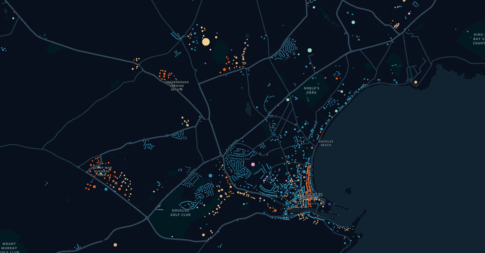

# Quick Start

Extract `home`, `work`, `education`, `shop` and various other activity locations ("facilities") for the Isle of Man, using the following steps (paths is given from OSMOX project root):

First download `isle-of-man-latest.osm.pbf` from [geofabrik](https://download.geofabrik.de/europe/isle-of-man.html) and place in an `example` directory.
Then run:

```sh
osmox run configs/example.json example/isle-of-man-latest.osm.pbf isle-of-man -crs epsg:27700 -l
```

After about 30 seconds, you should find the outputs in geojson format in the same `example` directory as your OSM input file.
The geojson file contains locations for the extracted facilities, and each facility includes a number of features with coordinates given in WGS-84 (EPSG:4326) coordinate reference system (CRS), so that they can be quickly inspected using [geopandas](https://geopandas.org/en/stable) or equivalent.

`-l` is short for `--lazy` which helps osmox run a little faster.

```json
{
    "type": "FeatureCollection",
    "features": [
        ...
        {
        "id": "13589",
        "type": "Feature",
        "properties": {
            "activities": "home",
            "area": 196,
            "distance_to_nearest_education": 816.4434678355371,
            "distance_to_nearest_medical": 366.81198701080626,
            "distance_to_nearest_shop": 133.12877450643526,
            "distance_to_nearest_transit": 122.33125535187033,
            "floor_area": 392.0,
            "id": 1869954720,
            "levels": 2.0,
            "units": 1
            },
        "geometry": {
            "type": "Point",
            "coordinates": [220894.60596542264, 467332.85704661923]
            }
        },
        ...
```

<figure>

<figcaption>Isle of Man facility `floor_area` feature. Approximated based on polygon areas and floor labels or sensible defaults.</figcaption>
</figure>

<figure>

<figcaption>Isle of Man `activities` feature.
For simulations we use this information to control what agents can do where, but this is also a good disaggregate proxy for land-use.
In this example, blue areas are residential, orange commercial and brown is other work places.</figcaption>
</figure>
